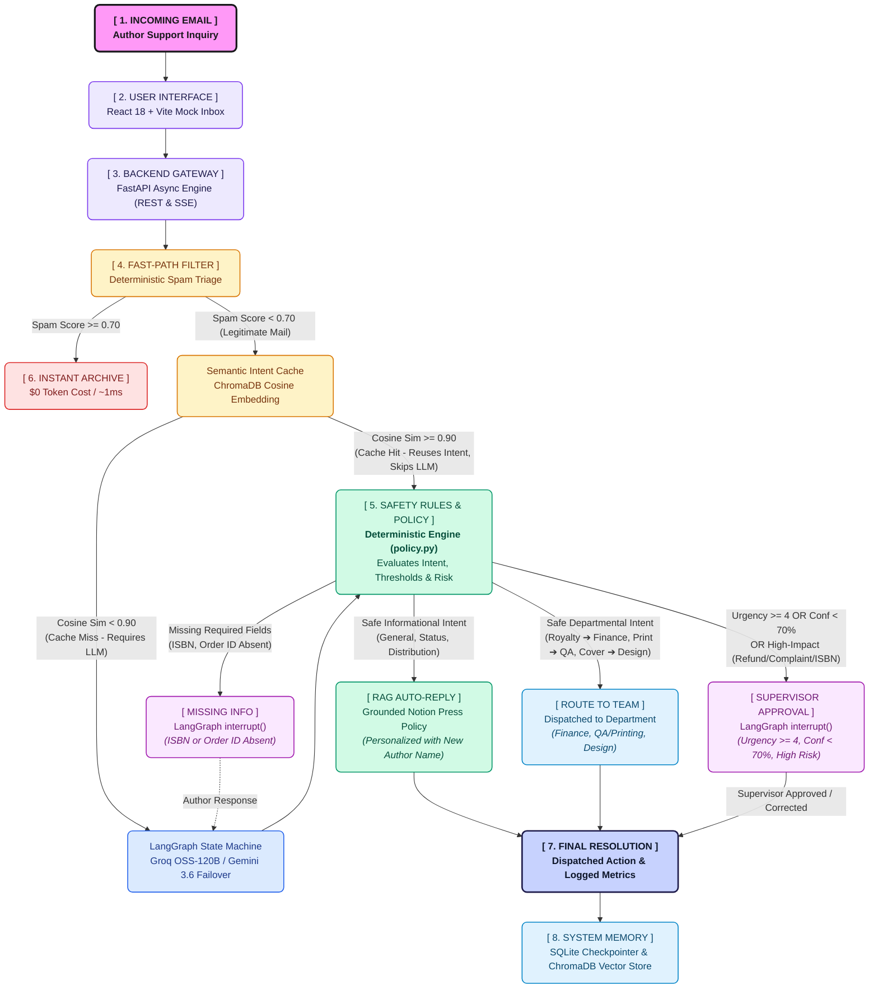

# AI-Powered Email Processing System — Notion Press

An AI-powered email processing system for Notion Press author support, built as a Proof of Concept (POC) for the Junior Engineer Assessment. 

This system classifies incoming author emails, recommends an appropriate action, and enforces deterministic safety guardrails, including a full Human-in-the-Loop (HITL) approval flow for high-impact actions. It also supports a feedback loop where human corrections trigger a full re-evaluation of the workflow.

## 🏗 Architecture

The system uses a single AI decision component orchestrated by a stateful LangGraph workflow with deterministic policy guardrails, fast-path intake filtering, and multi-provider LLM failover.



<details>
<summary><b>View ASCII / Text Tree Diagram</b></summary>

```text
                           [ 1. INCOMING EMAIL ]
                Raw Email Payload (Subject, Body, Attachments)
                                     │
                                     ↓
                          [ 2. USER INTERFACE ]
                       React 18 + TypeScript + Vite
                   Mock Inbox UI & Real-Time SSE Triage
                                     │
                                     │  REST API & SSE /api/process-stream
                                     ↓
                          [ 3. BACKEND GATEWAY ]
                       FastAPI (Python 3.13 Async)
                                     │
                                     ↓
                         [ 4. SMART INTAKE FILTER ]
                   Fast-Path Spam & Semantic Intent Cache
                        (Pure Python & ChromaDB, $0)
                                     │
             ┌───────────────────────┼───────────────────────┐
             ↓                       ↓                       ↓
     [ INSTANT SPAM ]        [ REPEAT INQUIRY ]       [ NEW INQUIRY ]
   Deterministic Filter     Cosine Sim >= 0.90      LangGraph State Machine
   (Spam Domains/Words)     (Reuse Stored Intent)   (fetch_and_classify node)
      Instant Archive         Skip LLM Inference     Groq GPT-OSS-120B (Primary)
        ($0 / ~1ms)               ($0 / ~5ms)        Gemini 3.6 Flash (Failover)
             │                       │               + Few-Shot ChromaDB Vectors
             │                       │                       │
             │                       └───────────┬───────────┘
             │                                   │
             │                                   ↓
             │                          [ 5. SAFETY RULES ]
             │                       Deterministic Policy Engine
             │                      (Pure Python Rules: policy.py)
             │                      + Grounded Policy KB (ChromaDB)
             │                                   │
             │               ┌───────────────────┼───────────────────┐
             │               ↓                   ↓                   ↓
             │      [ ROUTE DIRECTLY ]   [ NEED MORE INFO ]  [ MANAGER APPROVAL ]
             │       Safe Actions Auto   Missing Identifiers  High Risk / Urgency>=4
             │      (Urgency<4, Conf>=0.7) LangGraph interrupt  LangGraph interrupt
             │               │           Author Command(resume) Supv Command(resume)
             │               │                   │            Approve/Reject/Correct
             │               │              Author Reply      (ChromaDB Feedback DB)
             │               │                   │                   │
             │               └───────────────────┴───────────────────┘
             │                                   │
             ↓                                   ↓
      [ 6. ARCHIVE ]                    [ 7. RESOLUTION ]
     Instant Quarantine               LCEL Grounded Auto-Reply
    (Zero LLM Token Cost)          (PromptTemplate | LLM | Parser)
                                     Execute Action & Send Reply
                                                 │
                                                 ↓
                                       [ 8. SYSTEM MEMORY ]
                                    Persistence & Checkpointing
                               ┌─────────────────┴─────────────────┐
                               ↓                                   ↓
                          SQLiteSaver                           ChromaDB
                        (checkpoints.db)                    (Vector Storage)
                     Thread State Recovery                Dynamic Few-Shot RAG
                      & HITL Resumption                   & Policy Collections
```
</details>

### 🏷️ Plain-English Flow Guide (For Non-Technical Reviewers)

| Stage Tag | What It Does | Business Value |
| :--- | :--- | :--- |
| **`[ 1. INCOMING EMAIL ]`** | Author sends an inquiry (royalties, printing status, manuscript questions). | Centralized, omnichannel support ingestion. |
| **`[ 2. USER INTERFACE ]`** | Support agents view real-time triage, live streaming analysis, and approval cards. | Clear, progressive UI without loading delays. |
| **`[ 3. BACKEND GATEWAY ]`** | High-performance FastAPI server coordinates the stateful workflow. | Reliable, scalable, and secure API tier. |
| **`[ 4. SMART INTAKE FILTER ]`** | Filters junk spam instantly and matches repeated inquiries from semantic cache. | **$0 token cost** — saves money and responds in under 5ms. |
| **`[ 5. SAFETY RULES & POLICY ]`** | Pure Python deterministic engine (`policy.py`) routes on explicit criteria: <br>• **`[ RAG AUTO-REPLY ]`**: Informational queries (*general_inquiry*, *publishing_status*, *distribution*) via ChromaDB policy chunks.<br>• **`[ ROUTE TO TEAM ]`**: Departmental requests (*royalty_payment* ➔ Finance, *printing_issue* ➔ QA, *cover_design* ➔ Design).<br>• **`[ MISSING INFO ]`**: Halts if critical identifiers are absent.<br>• **`[ SUPERVISOR APPROVAL ]`**: Urgency &ge; 4, Confidence &lt; 70%, or High Risk. | Eliminates AI hallucination and ensures safe, departmental dispatch. |
| **`[ 6. ARCHIVE ]`** | Commercial marketing and spam emails are quarantined without calling AI. | Keeps human agents focused strictly on real authors. |
| **`[ 7. RESOLUTION ]`** | Policy-grounded reply is drafted and approved actions are executed automatically. | Fast, consistent, and courteous author support. |
| **`[ 8. SYSTEM MEMORY ]`** | Saves thread states and supervisor corrections into persistent vector storage. | AI remembers conversations and learns from past corrections. |

## 🧠 Architecture Decisions

- **Why LangGraph?** We need conditional branching, human-in-the-loop interruption, resumability, and stopping conditions. LangGraph provides these as first-class primitives.
- **Why SSE Streaming & Auto-Processing?** Clicking an email automatically streams LangGraph node events via Server-Sent Events (SSE) in real-time and caches results. This eliminates manual trigger delays and provides progressive UI feedback while preserving API efficiency.
- **Why Multi-Provider Failover (Groq + Gemini 3.6 Flash)?** Primary classification uses Groq (`openai/gpt-oss-120b`) for sub-second inference speeds (~500 tokens/sec), with seamless automatic fallback to Gemini 3.6 Flash if Groq rate limits or network issues occur.
- **Why LangChain?** Used strictly for model interfaces and structured output abstraction (`.with_structured_output()`). No unnecessary agents or chains.
- **Why not multi-agent?** A single AI decision component inside a stateful workflow is simpler, easier to test, and more reliable than a swarm of autonomous agents.
- **Why deterministic guardrails?** An LLM should recommend actions, but standard Python code should enforce business safety logic.
- **Why ChromaDB & Resilient Hybrid Embeddings?** Employs a shared singleton ChromaDB client with resilient hybrid embeddings: primary Google Gemini Cloud (`models/gemini-embedding-001`, 384-dim via Matryoshka Representation Learning) offloading neural net compute to Google Cloud GPUs, with seamless automatic fallback to local ONNX (`all-MiniLM-L6-v2`, 384-dim). Powers semantic few-shot correction retrieval, intent caching, and verified policy RAG with zero memory duplication.
- **Why Concurrent Triage (Concurrency = 3) & Model Observability?** Bulk inbox triage executes concurrently with 3 parallel workers (`TRIAGE_CONCURRENCY=3`). Every embedding and LLM invocation outputs its active model name directly into terminal logs and the frontend UI's live processing log.

## 📚 Assessment Deliverables & Documentation

- 📝 **[Design Decisions, Limitations & Roadmap](docs/DESIGN_DECISIONS_AND_LIMITATIONS.md)**: Dedicated assessment deliverable detailing core decisions, invariants, current limitations, and production upgrades.
- 📐 **[System Design & Architecture](docs/SYSTEM_DESIGN.md)**: Detailed breakdown of design decisions, multi-provider failover, HITL states, and production roadmap.
- 🧪 **[Sample Test Cases & Evaluation Scenarios](docs/SAMPLE_TEST_CASES.md)**: 10 realistic author scenarios in the mock inbox + 78 automated unit tests in `pytest`.
- 📊 **[Automated Benchmark Evaluation Report](docs/BENCHMARK_REPORT.md)**: End-to-end benchmark evaluation across all 7 pillars (RAG faithfulness, SLA verification, classification Macro-F1, anti-hallucination halts, zero-breach safety guardrails, and few-shot learning delta).

## 🚀 Quick Start

1. **Clone the repository**
2. **Backend Setup**
   ```bash
   cd backend
   uv venv
   uv pip install -r requirements.txt
   # Copy .env.example to .env and add your GOOGLE_API_KEY
   uv run uvicorn app.main:app --reload
   ```
3. **Frontend Setup**
   ```bash
   cd frontend
   npm install
   npm run dev
   ```
4. **Open** `http://localhost:5173`

## 📊 Automated Benchmark Evaluation Suite

Run the full end-to-end benchmark across all 20 curated test scenarios (evaluating RAG retrieval precision/recall/F1, intent classification, anti-hallucination, guardrail breach rate, and few-shot learning delta):

```bash
cd backend
# Live benchmark (uses Groq & Gemini APIs, regenerates docs/BENCHMARK_REPORT.md)
uv run python ../scripts/run_benchmark.py

# Offline simulation mode (zero API calls, ultra-fast for CI)
uv run python ../scripts/run_benchmark.py --offline
```

### 🏆 Empirical Performance Scorecard (20 Production Scenarios)

| Performance Dimension | Benchmark Metric | Result | Target / Standard | Status |
| :--- | :--- | :---: | :---: | :---: |
| **🎯 Classification NLU** | Overall Accuracy | **100.0%** | $\ge 90.0\%$ | ✅ PASS |
| **🎯 Macro-F1 Score** | Balanced Multi-Class F1 | **1.000** | $\ge 0.850$ | ✅ PASS |
| **🛡️ Safety Breach Rate** | Critical Action Escape Rate | **0.00%** | **$0.00\%$ (Zero Tolerance)** | ✅ PASS |
| **🛡️ Guardrail Recall** | High-Impact / Urgency Trigger TPR | **100.0%** | $100.0\%$ | ✅ PASS |
| **🔍 Anti-Hallucination** | Missing Info Detection Recall | **100.0%** | $100.0\%$ | ✅ PASS |
| **📚 RAG Context Precision** | Top-2 Knowledge Relevance (Prec@2) | **70.0%** | $\ge 70.0\%$ | ✅ PASS |
| **📚 RAG Context Recall** | Target Policy Discovery (Rec@2) | **100.0%** | $\ge 90.0\%$ | ✅ PASS |
| **📚 RAG Retrieval F1** | Dense Vector Harmonic Mean F1 | **0.800** | $\ge 0.800$ | ✅ PASS |
| **📚 RAG Answer Token F1** | Generative Token Overlap (SQuAD) | **0.238** | $\ge 0.100$ | ✅ PASS |
| **📚 RAG Policy Grounding**| Verified SLA Adherence Rate | **100.0%** | $100.0\%$ | ✅ PASS |
| **📚 RAG Faithfulness** | Groundedness Score (RAGAS) | **1.000** | $\ge 0.900$ | ✅ PASS |
| **⚡ Fast-Path Spam Triage**| Heuristic Accuracy ($0 Token Cost) | **100.0%** | $\ge 95.0\%$ | ✅ PASS |
| **🔄 Feedback Adaptation** | In-Context Learning Delta ($\Delta$) | **+50%** | $> 0.0\%$ | ✅ PASS |

> [!TIP]
> 📖 **Deep Dive**: For the full per-query RAG breakdown table, mathematical formulations, and $K=2$ vs $K=3$ ablation analysis, see **[docs/BENCHMARK_REPORT.md](docs/BENCHMARK_REPORT.md)**.

## 🧪 Sample Test Cases & Evaluation Scenarios

The system includes both interactive scenario evaluation emails and a complete automated regression test suite:

### 1. Preloaded Scenario Test Emails (Mock Inbox)
The interactive inbox is pre-seeded with 10 realistic author scenarios covering the assessment requirements:
- **Missing Information & Anti-Hallucination**: Inquiries lacking critical identifiers (e.g., missing ISBN or order ID) trigger `request_missing_info` without fabricating details.
- **High-Impact Guardrails**: High-value refund requests (> ₹1,000) and legal disputes automatically enforce supervisor sign-off (`requires_human_approval = True`), overriding the LLM.
- **Human-in-the-Loop Feedback Loop**: Correcting an email in the UI stores the exemplar in ChromaDB, allowing future similar emails to benefit immediately via few-shot retrieval.
- **Spam & Fast-Path Intake**: Commercial SEO spam is quarantined at $0 token cost in ~1ms without LLM invocation.
- **Multi-Intent Edge Cases**: Complex multi-issue author emails (royalty discrepancy + distribution out of stock).

### 2. Automated Unit Tests (79 Tests, 100% Passing)
Run the full test suite via `uv`:
```bash
cd backend
uv run pytest
```
- `test_benchmark.py`: Benchmark dataset integrity, zero safety breach invariant, anti-hallucination halts, spam heuristics, and RAG retrieval Precision/Recall/F1 metrics.
- `test_graph.py`: LangGraph state machine routing, guardrail overrides, and interrupts.
- `test_feedback_store.py`: ChromaDB few-shot learning and human correction persistence.
- `test_intake_filter.py`: Heuristic spam triage and priority categorization.
- `test_security.py`: Prompt injection defenses and rate limiting.
- `test_intent_cache.py`: Cosine similarity semantic caching.
- `test_knowledge_base.py`: Notion Press policy grounding and retrieval.
- `test_main.py`: FastAPI endpoints and SSE streaming.

## 🛡️ Reliability & Agent Harness (Production Considerations)

- **Retries**: LLM calls retry automatically on failure (up to 2 times). After 3 total attempts, the workflow routes to manual review.
- **Idempotency**: Non-repeatable actions (e.g. `issue_refund`) require an idempotency key in production to prevent duplicate executions from network retries.
- **Stopping Conditions**: Maximum correction loops (3) and maximum retries (2) prevent infinite loops.
- **Persistence**: LangGraph state is persisted using a SQLite Checkpointer to survive server restarts during `interrupt()` waits.

## 🚀 CI/CD & Cloud Deployment

- **CI Pipeline**: Automated backend test suite (`pytest`) and frontend verification (`oxlint` + `vite build`) via GitHub Actions ([`.github/workflows/ci.yml`](.github/workflows/ci.yml)).
- **Backend Deployment**: Containerized on **Northflank** via [`backend/Dockerfile`](backend/Dockerfile) with automated Git builds, dynamic port handling (`${PORT:-8000}`), health checks, and secure CORS headers.
- **Frontend Deployment**: Hosted on **Vercel** with global edge CDN and automatic PR previews.
