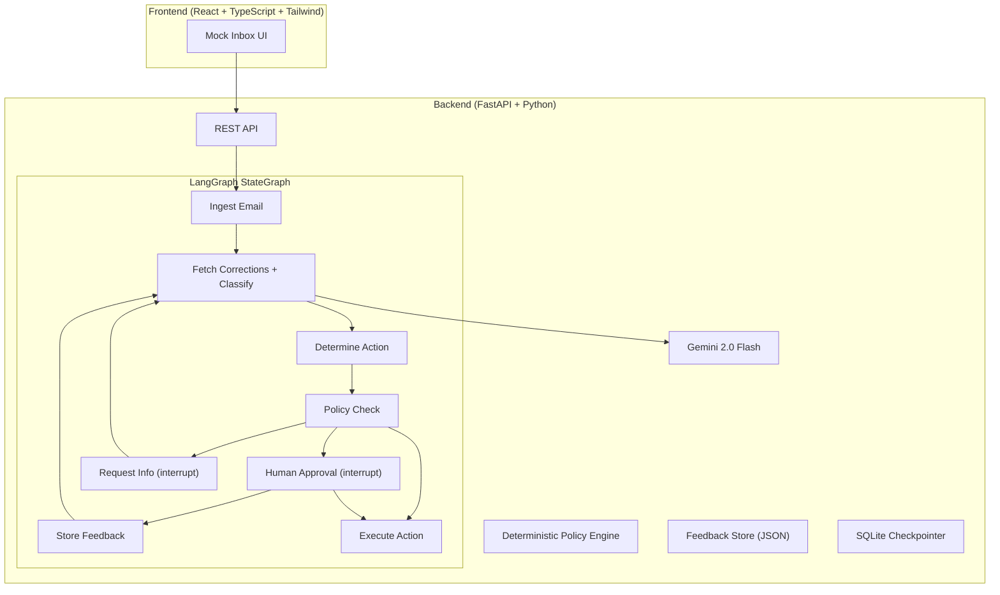

# AI-Powered Email Processing System — Notion Press

An AI-powered email processing system for Notion Press author support, built as a Proof of Concept (POC) for the Junior Engineer Assessment. 

This system classifies incoming author emails, recommends an appropriate action, and enforces deterministic safety guardrails, including a full Human-in-the-Loop (HITL) approval flow for high-impact actions. It also supports a feedback loop where human corrections trigger a full re-evaluation of the workflow.

## 🏗 Architecture

The system uses a single AI decision component orchestrated by a stateful LangGraph workflow.



## 🧠 Architecture Decisions

- **Why LangGraph?** We need conditional branching, human-in-the-loop interruption, resumability, and stopping conditions. LangGraph provides these as first-class primitives.
- **Why LangChain?** Used strictly for model interfaces and structured output abstraction (`.with_structured_output()`). No unnecessary agents or chains.
- **Why not multi-agent?** A single AI decision component inside a stateful workflow is simpler, easier to test, and more reliable than a swarm of autonomous agents.
- **Why deterministic guardrails?** An LLM should recommend actions, but standard Python code should enforce business safety logic.
- **Why no Vector DB?** For a POC with few corrections, a JSON store with category-based filtering is optimal.

## 🚀 Quick Start

1. **Clone the repository**
2. **Backend Setup**
   ```bash
   cd backend
   uv venv
   uv pip install -r requirements.txt
   # Copy .env.example to .env and add your GOOGLE_API_KEY
   uv run uvicorn app.main:app --reload
   ```
3. **Frontend Setup**
   ```bash
   cd frontend
   npm install
   npm run dev
   ```
4. **Open** `http://localhost:5173`

## 🛡️ Reliability & Agent Harness (Production Considerations)

- **Retries**: LLM calls retry automatically on failure (up to 2 times). After 3 total attempts, the workflow routes to manual review.
- **Idempotency**: Non-repeatable actions (e.g. `issue_refund`) require an idempotency key in production to prevent duplicate executions from network retries.
- **Stopping Conditions**: Maximum correction loops (3) and maximum retries (2) prevent infinite loops.
- **Persistence**: LangGraph state is persisted using a SQLite Checkpointer to survive server restarts during `interrupt()` waits.
