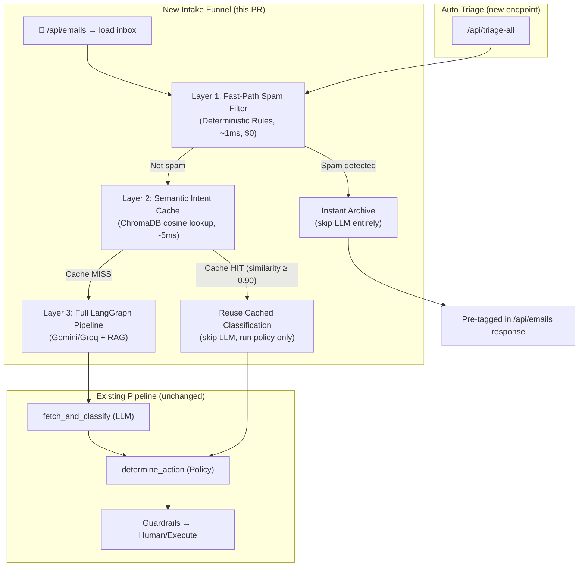
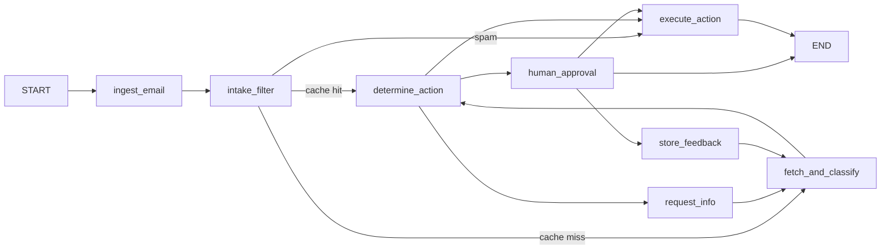

# Multi-Tier Email Intake Optimization

Add an intelligent intake funnel that prevents wasteful LLM calls by filtering spam via deterministic rules, caching repeated intent classifications via semantic similarity, and auto-triaging the entire inbox on load—so that an agent never has to manually click a spam email for the AI to classify it.

## User Review Required

> [!IMPORTANT]
> **Scope Decision:** This plan adds 3 new backend modules and modifies the LangGraph DAG. The core existing pipeline (classify → policy → guardrail → human approval → execute) remains untouched. The new layers sit **in front of** the existing pipeline, not inside it.

> [!WARNING]
> **No New Dependencies:** We reuse ChromaDB (already installed) for the semantic intent cache. The fast-path spam filter uses pure Python heuristics—no new `pip install` required.

## Open Questions

> [!IMPORTANT]
> **Q1: Batch auto-triage concurrency.** When the frontend loads 10 emails, should we triage all 10 in parallel (fast but hits LLM rate limits), or sequentially (slower but safe)? Plan defaults to **sequential with 2-worker concurrency** to balance speed and safety.

> [!IMPORTANT]
> **Q2: Semantic cache scope.** Should the intent cache persist across server restarts (ChromaDB persistent collection), or reset each session? Plan defaults to **persistent** so the cache improves over time.

---

## Architecture Overview



---

## Proposed Changes

### Backend: New Intake Filter Module

#### [NEW] [`intake_filter.py`](file:///d:/My%20projects/Notion%20press%20POC/backend/app/intake_filter.py)

A pure-Python fast-path spam & low-value email detector. Zero LLM calls.

**Responsibilities:**
- **Sender blocklist check:** Known spam domains (`spamservices.com`, `marketing-blast.com`, etc.) and configurable patterns.
- **Subject keyword scoring:** Weighted keyword match against spam indicators (`"SEO"`, `"guaranteed"`, `"click here"`, `"$99"`, `"bestseller hack"`, etc.).
- **Header heuristics:** Check for commercial/promotional patterns (excessive caps, multiple exclamation marks, URL density in body).
- **Returns:** A `FastPathResult` with `is_spam: bool`, `confidence: float`, `reason: str`, and the pre-built `EmailClassification` + `RecommendedAction` if spam is detected.

**Key design decisions:**
- The spam filter produces a **full `EmailClassification` object** (intent=`"spam"`, confidence=`0.99`, urgency=`1`) so it can be plugged directly into the existing `processingState` on the frontend without any type changes.
- A configurable `SPAM_CONFIDENCE_THRESHOLD` (default `0.80`) controls how aggressive the filter is. Below threshold, the email falls through to the LLM.

---

#### [NEW] [`intent_cache.py`](file:///d:/My%20projects/Notion%20press%20POC/backend/app/intent_cache.py)

Semantic intent cache using a dedicated ChromaDB collection. Stores past classification results keyed by email text embeddings.

**Responsibilities:**
- **On classification completion:** Store the email text embedding → classification mapping in a `"intent_cache"` ChromaDB collection.
- **On new email:** Query the cache with cosine similarity. If a match is found with **similarity ≥ 0.90**, return the cached classification directly.
- **Cache invalidation:** When a human correction is stored via `store_feedback`, invalidate any cached entries for that intent category (prevents stale cache from overriding corrections).

**Key design decisions:**
- Uses a **separate ChromaDB collection** (`intent_cache`) from the existing `human_corrections` collection—keeps concerns cleanly separated.
- The high threshold (0.90) ensures only near-duplicate emails hit the cache. Ambiguous emails always go to the LLM.
- Exposes `cache_classification()` and `get_cached_classification()` methods.

---

#### [MODIFY] [`graph.py`](file:///d:/My%20projects/Notion%20press%20POC/backend/app/graph.py)

Add a new `intake_filter` node as the **first node after `ingest_email`** in the LangGraph DAG.

**Changes:**

1. **New node: `intake_filter_node`** — Runs the fast-path spam filter + semantic cache check.
   - If spam detected → Sets classification, action, guardrail, `final_status="executed"`, and routes directly to `execute_action` (skipping `fetch_and_classify` entirely).
   - If cache hit → Sets classification from cache, routes to `determine_action` (skipping `fetch_and_classify` but still running policy/guardrails).
   - If neither → Falls through to existing `fetch_and_classify`.

2. **New conditional edge: `route_after_intake`** — Routes to `execute_action` (spam), `determine_action` (cache hit), or `fetch_and_classify` (cache miss).

3. **Update `fetch_and_classify`** — After successful LLM classification, call `intent_cache.cache_classification()` to populate the cache for future emails.

4. **Update `store_feedback`** — After saving a human correction, call `intent_cache.invalidate_for_intent()` to bust stale cache entries.

**Updated DAG:**


---

#### [MODIFY] [`models.py`](file:///d:/My%20projects/Notion%20press%20POC/backend/app/models.py)

- Add `intake_result` field to `EmailProcessingState`: `intake_result: str | None` — Values: `"spam_filtered"`, `"cache_hit"`, `None` (full pipeline). This lets the UI distinguish how an email was classified.
- Add `FastPathResult` Pydantic model.

---

#### [MODIFY] [`config.py`](file:///d:/My%20projects/Notion%20press%20POC/backend/app/config.py)

Add intake filter configuration constants:
- `SPAM_KEYWORDS`: Weighted keyword dict for spam scoring.
- `SPAM_SENDER_BLOCKLIST`: Set of known spam sender domains.
- `SPAM_CONFIDENCE_THRESHOLD`: Float (default `0.80`).
- `INTENT_CACHE_SIMILARITY_THRESHOLD`: Float (default `0.90`).

---

#### [MODIFY] [`main.py`](file:///d:/My%20projects/Notion%20press%20POC/backend/app/main.py)

Add a new **batch auto-triage endpoint**:

```python
@app.post("/api/triage-all")
async def triage_all_emails():
```

**Behavior:**
- Accepts a list of email IDs (or defaults to all sample emails).
- Runs each email through the full LangGraph pipeline (which now includes the intake filter as the first node).
- Returns a dict of `{ email_id: ProcessingResponse }` with pre-computed classifications, actions, and statuses.
- Uses `asyncio` with a semaphore (max 2 concurrent) to avoid rate-limiting.

Also modify `GET /api/emails` to include a `triage_status` field indicating whether each email has been pre-triaged.

---

### Backend: Tests

#### [NEW] [`test_intake_filter.py`](file:///d:/My%20projects/Notion%20press%20POC/backend/tests/test_intake_filter.py)

- `test_spam_sender_blocklist`: Verify `spambot@spamservices.com` is caught.
- `test_spam_keyword_scoring`: Verify subject with "SEO", "$99", "guaranteed" scores above threshold.
- `test_legitimate_email_passthrough`: Verify real author queries are NOT flagged as spam.
- `test_borderline_spam_below_threshold`: Verify low-scoring spam falls through to LLM.

#### [NEW] [`test_intent_cache.py`](file:///d:/My%20projects/Notion%20press%20POC/backend/tests/test_intent_cache.py)

- `test_cache_miss_on_empty`: Verify no false hits on empty cache.
- `test_cache_hit_on_similar_email`: Verify near-duplicate email returns cached classification.
- `test_cache_miss_on_dissimilar_email`: Verify different topic does not match.
- `test_cache_invalidation_on_correction`: Verify human correction clears stale cache.

---

### Frontend Changes

#### [MODIFY] [`EmailList.tsx`](file:///d:/My%20projects/Notion%20press%20POC/frontend/src/components/EmailList.tsx)

- **Remove the hardcoded string hacks** (`email.subject.toLowerCase().includes("seo")` and `email.sender.toLowerCase().includes("spam")`).
- The `isArchived()` function will now rely **solely on actual processing state** from the backend:
  ```typescript
  const isArchived = (email: Email) => {
    const state = processingState[email.id]?.state;
    return state?.recommended_action?.action_type === "archive" || 
           state?.classification?.intent === "spam";
  };
  ```
- Add a visual badge for `intake_result`:
  - `"spam_filtered"` → Shows ⚡ "Fast-Path Filtered" tag (instead of the normal "AI Triaging..." animation).
  - `"cache_hit"` → Shows 💾 "Cached" tag.

---

#### [MODIFY] [`App.tsx`](file:///d:/My%20projects/Notion%20press%20POC/frontend/src/App.tsx)

- **Add auto-triage on inbox load:** After `getEmails()` returns, call the new `/api/triage-all` endpoint to pre-process all emails in the background.
- As results stream back, populate `processingState` for each email.
- Spam emails will immediately appear in the Archive tab with full triage trace—no click required.

---

#### [MODIFY] [`api.ts`](file:///d:/My%20projects/Notion%20press%20POC/frontend/src/api.ts)

Add:
```typescript
export async function triageAllEmails(emailIds: string[]): Promise<Record<string, ProcessingResponse>> {
  const res = await fetch(`${BASE}/triage-all`, {
    method: "POST",
    headers: { "Content-Type": "application/json" },
    body: JSON.stringify({ email_ids: emailIds }),
  });
  return res.json();
}
```

---

#### [MODIFY] [`types.ts`](file:///d:/My%20projects/Notion%20press%20POC/frontend/src/types.ts)

Add `intake_result?: "spam_filtered" | "cache_hit" | null` to the `ProcessingResponse.state` interface.

---

#### [MODIFY] [`PipelineView.tsx`](file:///d:/My%20projects/Notion%20press%20POC/frontend/src/components/PipelineView.tsx)

Add an "Intake Filter" step at the top of the pipeline visualization:
```typescript
{
  name: "Intake Filter",
  active: true,
  done: true,
  label: state.intake_result === "spam_filtered" ? "⚡ Fast-Path Spam" :
         state.intake_result === "cache_hit" ? "💾 Cache Hit" : "Passed to LLM"
}
```

When `intake_result` is `"spam_filtered"`, the pipeline view will show that `fetch_and_classify` was **skipped** (greyed out), making it visually clear that no LLM tokens were spent.

---

## File Change Summary

| File | Action | Layer |
| :--- | :--- | :--- |
| [`intake_filter.py`](file:///d:/My%20projects/Notion%20press%20POC/backend/app/intake_filter.py) | **NEW** | Fast-path spam detector |
| [`intent_cache.py`](file:///d:/My%20projects/Notion%20press%20POC/backend/app/intent_cache.py) | **NEW** | Semantic classification cache |
| [`graph.py`](file:///d:/My%20projects/Notion%20press%20POC/backend/app/graph.py) | MODIFY | New intake node + DAG edges |
| [`models.py`](file:///d:/My%20projects/Notion%20press%20POC/backend/app/models.py) | MODIFY | `FastPathResult` + state field |
| [`config.py`](file:///d:/My%20projects/Notion%20press%20POC/backend/app/config.py) | MODIFY | Spam keywords & thresholds |
| [`main.py`](file:///d:/My%20projects/Notion%20press%20POC/backend/app/main.py) | MODIFY | `/api/triage-all` endpoint |
| [`test_intake_filter.py`](file:///d:/My%20projects/Notion%20press%20POC/backend/tests/test_intake_filter.py) | **NEW** | Spam filter tests |
| [`test_intent_cache.py`](file:///d:/My%20projects/Notion%20press%20POC/backend/tests/test_intent_cache.py) | **NEW** | Cache tests |
| [`EmailList.tsx`](file:///d:/My%20projects/Notion%20press%20POC/frontend/src/components/EmailList.tsx) | MODIFY | Remove hacks, add badges |
| [`App.tsx`](file:///d:/My%20projects/Notion%20press%20POC/frontend/src/App.tsx) | MODIFY | Auto-triage on load |
| [`api.ts`](file:///d:/My%20projects/Notion%20press%20POC/frontend/src/api.ts) | MODIFY | `triageAllEmails()` |
| [`types.ts`](file:///d:/My%20projects/Notion%20press%20POC/frontend/src/types.ts) | MODIFY | `intake_result` field |
| [`PipelineView.tsx`](file:///d:/My%20projects/Notion%20press%20POC/frontend/src/components/PipelineView.tsx) | MODIFY | Intake filter step |

---

## Verification Plan

### Automated Tests
```bash
cd backend
uv run pytest tests/test_intake_filter.py -v
uv run pytest tests/test_intent_cache.py -v
uv run pytest tests/test_feedback_store.py -v  # ensure existing tests still pass
```

### Manual Verification
1. **Start backend + frontend** and open `localhost:5173`.
2. **Verify spam auto-archive:** The SpamBot email should appear in the Archive tab immediately on page load—without clicking on it. The pipeline view should show "⚡ Fast-Path Spam" and the LLM classify step greyed out.
3. **Verify cache behavior:** Click on email #1 (Priya Sharma — royalties). After it processes, reload the page. On reload, the same email should show "💾 Cache Hit" and classify near-instantly (no LLM call).
4. **Verify correction invalidation:** Correct an email's intent via the Human Approval flow. Reload—the cache should be invalidated, and the email should go through the full LLM pipeline again with the correction context.
5. **Verify legitimate emails are not blocked:** All 9 non-spam emails should still pass through the intake filter unaffected and reach the full LangGraph pipeline.
