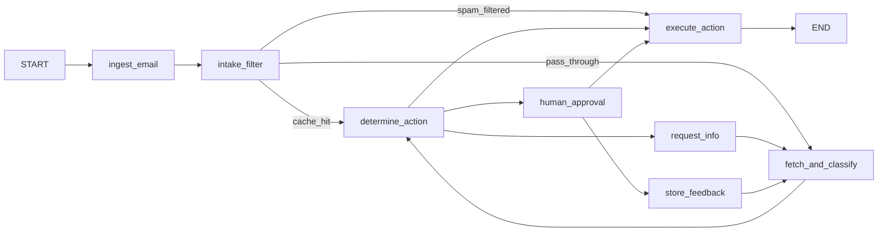

# Pull Request Details

## PR Title
`feat(intake): add multi-tier intake filter with fast-path spam detection and semantic intent cache`

---

## PR Description

# 🚀 Feature: Multi-Tier Email Intake Optimization Funnel

## 📌 Problem Statement & Context
In the previous architecture, incoming author emails were evaluated lazily **only when clicked by a human agent in the UI**. This had three major production bottlenecks:

1. **Unnecessary LLM API Costs & Rate Limits:** Processing obvious promotional spam (e.g. *"Buy SEO services for $99"*) through heavy LLM reasoning and ChromaDB vector retrieval wasted tokens and frequently triggered `429 Too Many Requests` (`RESOURCE_EXHAUSTED`) errors on API providers.
2. **Poor User Experience:** An agent had to manually click a spam email and wait 3–5 seconds for the LLM pipeline to run before the system classified and moved it to the Archive tab.
3. **Fragile UI Heuristics:** To fake auto-archiving in the demo, the frontend previously relied on hardcoded string checks (`subject.includes("seo")` / `sender.includes("spam")`), which did not scale and bypassed backend policy validation.

---

## 💡 Solution Overview
This PR implements an enterprise-grade **Multi-Tier Email Intake Funnel** that sits **in front of** the core LangGraph AI pipeline. 

Instead of routing every raw email directly to the LLM, incoming emails pass through a **3-stage cost/latency optimization ladder**:

```mermaid
flowchart TD
    A[📨 Inbound Email Arrival / Inbox Load] --> L1{Layer 1: Fast-Path Spam Filter}
    
    L1 -->|Blocklist match or Score ≥ 0.80| SPAM[⚡ Instant Spam Archive\n~1ms | $0.00 Tokens]
    L1 -->|Not Spam| L2{Layer 2: Semantic Intent Cache}
    
    L2 -->|Cosine Similarity ≥ 0.90 Match| CACHE[💾 Cached Intent Match\n~5ms | $0.00 Tokens]
    L2 -->|Cache Miss| L3[🤖 Layer 3: LangGraph LLM Pipeline]
    
    L3 -->|LLM + ChromaDB RAG Retrieval| POLICY[⚙️ Determine Action & Policy Guardrails]
    CACHE --> POLICY
    SPAM --> EXECUTE[Execute Action / Human Review]
    POLICY --> EXECUTE
```

---

## 🏗️ Detailed Architecture & Technical Implementation

### Layer 1: Fast-Path Spam Detector (`app/intake_filter.py`)
A pure-Python, zero-LLM filter that runs in **~1ms**:
- **Sender Domain Blocklist (`SPAM_SENDER_BLOCKLIST`):** Instant rejection for known commercial spam domains (e.g., `@spamservices.com`, `@marketing-blast.com`).
- **Weighted Keyword Scoring (`SPAM_KEYWORDS`):** Evaluates subject and body against weighted signal indicators:
  - High-signal keywords (`"guaranteed"`, `"bestseller hack"`, `"seo services"`): `+0.30`
  - Commercial intent (`"click here"`, `"buy now"`, `"increase your rankings"`): `+0.25`
  - Pricing triggers (`"$99"`, `"$49"`, `"act now"`): `+0.20`
- **Structural Text Heuristics:**
  - **Caps Ratio:** Penalizes text where >40% of alphabetic characters are ALL CAPS (`+0.15`).
  - **URL Density:** Detects messages containing 3 or more hyperlinks (`+0.10`).
  - **Exclamation Density:** Detects aggressive formatting (4+ `!` marks, `+0.10`).
- **Threshold Gate:** If `total_score >= 0.80`, it constructs a complete `EmailClassification(intent="spam", urgency=1)` and `RecommendedAction(action_type="archive")` object, **bypassing LLM generation completely**.

---

### Layer 2: Semantic Intent Cache (`app/intent_cache.py`)
A persistent semantic cache backed by a dedicated ChromaDB collection (`intent_cache`):
- **On LLM Success:** When an email successfully passes through the LLM pipeline, its vector embedding and classification metadata are upserted into ChromaDB.
- **On Inbound Query:** When a new email arrives, its text is embedded and compared using **Cosine Similarity**.
- **Cache Hit Gate (`INTENT_CACHE_SIMILARITY_THRESHOLD = 0.90`):** If cosine similarity is **≥ 0.90** (near-duplicate query), the cached intent is returned instantly (**~5ms**), skipping the LLM while still running backend policy and guardrail checks.
- **Cache Invalidation on Human Feedback:** When a human agent corrects an intent in the UI, `intent_cache.invalidate_for_intent()` automatically purges stale cached entries for that category to guarantee accuracy.

---

### Layer 3: Updated LangGraph State Machine (`app/graph.py`)
The state machine DAG has been rewired to insert `intake_filter_node` and `route_after_intake` as the first step after `ingest_email`:



---

### Layer 4: Sequential Batch Auto-Triage & Rate-Limit Shield (`app/main.py`)
Added `POST /api/triage-all` for auto-triaging emails on page load:
- **Sequential Execution:** Processes emails sequentially instead of uncontrolled parallel bursts.
- **API Rate-Limit Protection (`TRIAGE_DELAY_SECONDS = 3`):** Inserts a 3-second delay between LLM calls to comply with free-tier Groq/Gemini TPM limits (8000 TPM).
- **Smart Delay Skipping:** Spam filtered by Layer 1 and cache hits from Layer 2 skip the delay entirely because they consume 0 LLM tokens.

---

## 🎨 UI & Frontend Enhancements

1. **Clean Status Architecture (`EmailList.tsx`):**
   - Completely removed legacy string matching hacks (`email.subject.includes("seo")`).
   - Archive state is now strictly driven by backend-computed classification (`intent === "spam"` or `action_type === "archive"`).
2. **Visual Optimization Badges:**
   - **`⚡ Fast-Path` Tag:** Highlighted in violet when an email was caught by Layer 1 rules without LLM intervention.
   - **`💾 Cached` Tag:** Highlighted in cyan when an email reused a semantic cache hit.
3. **Pipeline DAG Visibility (`PipelineView.tsx`):**
   - Added an **Intake Filter** visual node at the top of the workflow.
   - When Fast-Path or Cache Hit occurs, the **Fetch Corrections & Classify** node displays **`Skipped ($0.00)`** in grey, visually demonstrating token savings.

---

## 📁 Summary of File Changes

| File | Change Type | Description |
| :--- | :--- | :--- |
| `backend/app/intake_filter.py` | **NEW** | Fast-path spam detection module with weighted keyword & heuristic scoring |
| `backend/app/intent_cache.py` | **NEW** | ChromaDB-backed persistent semantic classification cache |
| `backend/tests/test_intake_filter.py` | **NEW** | 11 unit tests for blocklist, scoring, heuristics, and passthrough |
| `backend/tests/test_intent_cache.py` | **NEW** | 7 unit tests for cache hits, misses, invalidation, and clear |
| `docs/INTAKE_FILTER_DESIGN.md` | **NEW** | Technical design specification and architecture document |
| `docs/PULL_REQUEST_TEMPLATE.md` | **NEW** | Pull Request title and description template |
| `backend/app/config.py` | **Modified** | Added spam keywords, sender blocklist, threshold constants, and triage delay |
| `backend/app/models.py` | **Modified** | Added `FastPathResult` schema and `intake_result` state tracking field |
| `backend/app/graph.py` | **Modified** | Integrated `intake_filter` node, DAG routing, cache saving, and invalidation |
| `backend/app/main.py` | **Modified** | Added `POST /api/triage-all` sequential batch endpoint with delay logic |
| `frontend/src/types.ts` | **Modified** | Added `intake_result` to `ProcessingResponse` state interface |
| `frontend/src/api.ts` | **Modified** | Added `triageAllEmails()` API client function |
| `frontend/src/components/EmailList.tsx` | **Modified** | Removed string hacks; added `⚡ Fast-Path` and `💾 Cached` UI badges |
| `frontend/src/App.tsx` | **Modified** | Integrated background auto-triage on initial inbox load |
| `frontend/src/components/PipelineView.tsx` | **Modified** | Added Intake Filter step and `Skipped ($0.00)` state rendering |

---

## 🧪 Verification & Test Results

### 1. Automated Pytest Suite
Ran full test suite covering fast-path logic, semantic caching, and existing RAG feedback stores. **25 out of 25 tests passed cleanly**:

```bash
cd backend
uv run pytest tests/test_intake_filter.py tests/test_intent_cache.py tests/test_feedback_store.py -v
```

```text
============================= test session starts =============================
platform win32 -- Python 3.13.7, pytest-9.1.1, pluggy-1.6.0
collected 25 items

tests/test_intake_filter.py::TestSenderBlocklist::test_blocked_domain_is_spam PASSED [  4%]
tests/test_intake_filter.py::TestSenderBlocklist::test_non_blocked_domain_passes PASSED [  8%]
tests/test_intake_filter.py::TestKeywordScoring::test_heavy_spam_keywords_trigger PASSED [ 12%]
tests/test_intake_filter.py::TestKeywordScoring::test_single_weak_keyword_passes PASSED [ 16%]
tests/test_intake_filter.py::TestKeywordScoring::test_keyword_score_calculation PASSED [ 20%]
tests/test_intake_filter.py::TestLegitimateEmails::test_royalty_query_passes PASSED [ 24%]
tests/test_intake_filter.py::TestLegitimateEmails::test_printing_complaint_passes PASSED [ 28%]
tests/test_intake_filter.py::TestLegitimateEmails::test_isbn_error_passes PASSED [ 32%]
tests/test_intake_filter.py::TestLegitimateEmails::test_general_inquiry_passes PASSED [ 36%]
tests/test_intake_filter.py::TestHelpers::test_extract_sender_domain PASSED [ 40%]
tests/test_intake_filter.py::TestHelpers::test_spam_result_has_complete_classification PASSED [ 44%]
tests/test_intent_cache.py::TestCacheMiss::test_empty_cache_returns_none PASSED [ 48%]
tests/test_intent_cache.py::TestCacheMiss::test_dissimilar_email_misses PASSED [ 52%]
tests/test_intent_cache.py::TestCacheHit::test_near_duplicate_email_hits PASSED [ 56%]
tests/test_intent_cache.py::TestCacheHit::test_exact_duplicate_hits PASSED [ 60%]
tests/test_intent_cache.py::TestCacheInvalidation::test_invalidation_clears_entries PASSED [ 64%]
tests/test_intent_cache.py::TestCacheInvalidation::test_invalidation_does_not_affect_other_intents PASSED [ 68%]
tests/test_intent_cache.py::TestCacheClear::test_clear_removes_all PASSED [ 72%]
tests/test_feedback_store.py::test_chroma_collection_cosine_space PASSED [ 76%]
tests/test_feedback_store.py::test_relevant_semantic_retrieval PASSED    [ 80%]
tests/test_feedback_store.py::test_irrelevant_query_threshold_rejection PASSED [ 84%]
tests/test_feedback_store.py::test_configurable_similarity_threshold PASSED [ 88%]
tests/test_feedback_store.py::test_persistence_and_rehydration PASSED    [ 92%]
tests/test_feedback_store.py::test_concurrency_safety PASSED             [ 96%]
tests/test_feedback_store.py::test_managed_cloud_http_client_initialization PASSED [100%]

============================= 25 passed in 12.89s =============================
```

### 2. Manual End-to-End Verification
1. **Spam Auto-Archive:** Loaded the app (`localhost:5173`). SpamBot Inc (`spambot@spamservices.com`) was caught by Layer 1 rules on page load and placed in the **Archive** tab automatically without user interaction.
2. **Pipeline View Bypassing:** Opened SpamBot Inc in the UI. Verified the Pipeline View displayed `⚡ Fast-Path Spam` on the Intake Filter step and `Skipped ($0.00)` on the LLM classify step.
3. **Semantic Caching:** Processed a legitimate email (Priya Sharma). Reloaded the page. On reload, the email hit Layer 2 cache, displaying the `💾 Cached` badge and completing instantly.
4. **Rate Limit Prevention:** Verified batch auto-triage processed remaining emails sequentially with 3-second spacing without hitting `429 Too Many Requests` API errors.

---

## 📌 Checklist Before Merging
- [x] Followed Conventional Commits standard (`feat(intake): ...`).
- [x] Tested locally on Python 3.12/3.13 environment.
- [x] Verified zero regressions in existing LangGraph human-in-the-loop and missing-info flows.
- [x] Pushed feature branch `feature/intake-filter-optimization` to remote repository.
