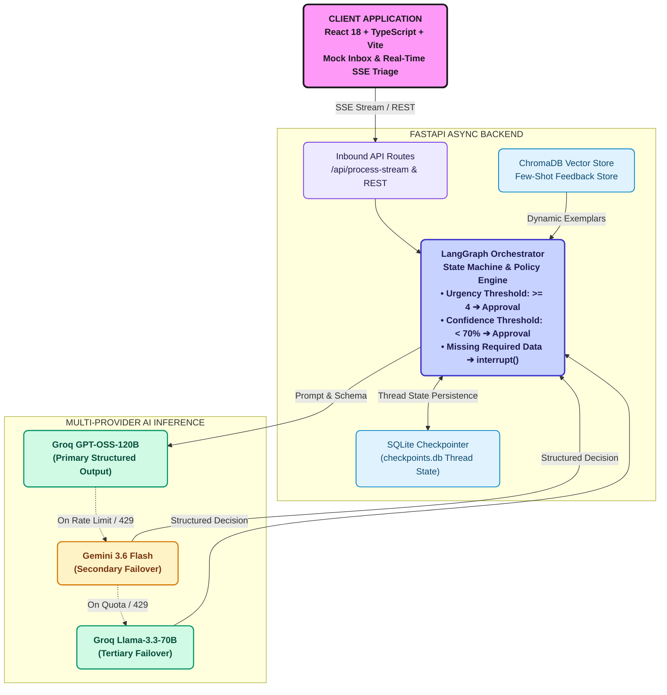
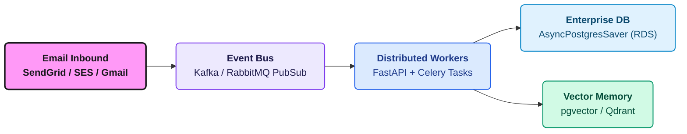

# Notion Press AI Author Support Hub — Architecture & System Design

This document details the architectural decisions, technology stack rationale, system design patterns, limitations, and the production roadmap for the **Notion Press AI Author Support Hub**.

---

## 1. Technology Stack Rationale

| Layer | Technology | Rationale & Trade-offs |
| :--- | :--- | :--- |
| **Orchestration & Workflow** | **LangGraph** (Python) | State-machine based orchestration designed for cyclic workflows, Human-in-the-Loop (`interrupt()` / `Command(resume=...)`), checkpoint serialization, and multi-turn state accumulation. Unlike linear chains (DAGs), LangGraph natively models iterative human feedback loops. |
| **Checkpointer & Persistence** | **SQLite Saver** (`SqliteSaver`) | Zero-configuration, file-based persistence for conversation threads and execution state snapshots. Allows any workflow to pause indefinitely while waiting for author info or human approval, surviving server restarts. |
| **Backend API** | **FastAPI** + **Uvicorn** + **SSE** | High-performance asynchronous Python web framework with native async streaming support (`StreamingResponse` for Server-Sent Events), Pydantic validation, and OpenAPI documentation out of the box. |
| **LLM Tier & 3-Tier Failover** | **Groq** (`openai/gpt-oss-120b`, Primary) + **Gemini 3.6 Flash** (Secondary) + **Groq Llama-3.3-70B** (Tertiary) | **Groq Primary** provides sub-second inference speeds (~500 tokens/sec). **Gemini 3.6 Flash** provides state-of-the-art fallback reasoning. **Groq Llama-3.3-70B** provides an independent high-capacity tertiary fallback if primary and secondary hit rate limits. |
| **Embedding Tier & Fallback** | **Google Gemini Cloud** (`models/gemini-embedding-001`, Primary) + **Local ONNX** (`all-MiniLM-L6-v2`, Fallback) | Hybrid 384-dimensional vector engine. Primary offloads vectorization to Google Cloud GPUs (1,500 RPM, $0 cost via Matryoshka Representation Learning truncation). Local ONNX takes over automatically if offline or API key absent. Used uniformly across Intent Cache, Few-Shot Feedback, and Policy RAG. |
| **Vector Storage & Caching** | **ChromaDB** (Singleton PersistentClient) | Cosine space (`hnsw:space: cosine`) vector database providing semantic intent caching, dynamic few-shot exemplar retrieval, and Notion Press policy RAG search. Managed via a thread-safe singleton to eliminate duplicate ONNX runtimes and prevent memory exhaustion. |
| **Frontend Framework** | **React 18** + **Vite** + **TypeScript** | Lightning-fast HMR build tooling, strong type safety matching backend Pydantic models, component-driven UI for reactive state updates and real-time SSE stream consumption via `AbortController`. |
| **Styling & Design System** | **Tailwind CSS** + Custom Design Tokens | Modern dark/light mode, sleek typography, subtle micro-animations, glassmorphism cards, and clean visual status indicators (pulsating triage badges, urgency meters, risk chips, and explicit departmental team routing tags). |
| **Cloud Deployment** | **Northflank** (Backend) + **Vercel** (Frontend) | Containerized Docker deployment on Northflank with dynamic port binding, health monitoring, environment secret management, and continuous Git deployment; global edge distribution on Vercel. |

---

## 2. Key Architecture & Design Decisions

### A. Zero-Wait Auto-Triage & Progressive SSE Streaming
* **Problem**: Requiring the user to manually click "Process with AI" on every email created unnecessary latency and friction.
* **Decision**: Implemented proactive streaming on email selection via `GET /api/process-stream/{email_id}` combined with client-side in-memory caching.
* **Benefit**: Support agents immediately see progressive node updates (`ingest` $\rightarrow$ `classify` $\rightarrow$ `policy` $\rightarrow$ `action`) with live animated pulsating badges. Switching back to an already triaged email renders instantly from cache with a "🔄 Re-analyze" option.

### B. Decoupled Deterministic Policy & Departmental Team Routing
* **Problem**: Pure LLM action execution is risky and unpredictable for mission-critical actions (e.g., refunds, database metadata changes, escalations).
* **Decision**: The LLM *only* performs intent classification, entity extraction, and missing information identification. Business decisions and departmental routing are evaluated by a **deterministic Python policy engine** (`backend/app/policy.py`):
  * **Departmental Team Routing**: Maps categories directly to assigned operational teams (*royalty_payment* ➔ Finance, *printing_issue* ➔ QA & Printing, *cover_design* ➔ Design, *isbn_metadata* ➔ Metadata, *complaint* ➔ Senior Support). Both UI cards, human approval dialogs, and execution confirmation banners display the target team.
  * **Urgency $\ge 4$**: Automatically triggers `human_approval`.
  * **Confidence $< 70\%$**: Automatically triggers `human_approval`.
  * **High-Impact Actions** (`issue_refund`, `modify_metadata`, `escalate`): Always require human supervisor sign-off.
  * **Missing Required Identifiers**: Halts routing and triggers `request_info`.

### C. 3-Tier Multi-Provider Automatic Failover
* **Problem**: Free-tier cloud LLM endpoints frequently suffer from burst rate limits (`429 Too Many Requests`) or daily quota caps (`429 RESOURCE_EXHAUSTED`).
* **Decision**: Implemented resilient 3-tier multi-provider routing in `backend/app/graph.py`:
  * **Tier 1 (Primary)**: Attempts `Groq` `openai/gpt-oss-120b` for sub-second classification (~500 tokens/sec).
  * **Tier 2 (Secondary Failover)**: If Groq primary encounters rate limits, automatically fails over to `Gemini 3.6 Flash`.
  * **Tier 3 (Tertiary Failover)**: If Gemini's daily quota is exhausted, automatically switches to `Groq` `llama-3.3-70b-versatile` on an independent rate limit bucket.
  * All three providers strictly adhere to the identical `EmailClassification` Pydantic structured output contract and LCEL RAG prompt template.

### D. In-Context Feedback Loop (Few-Shot Reinforcement)
* **Problem**: Fine-tuning or retraining weights on every single human correction is expensive, slow, and operationally impractical for day-to-day support triage.
* **Decision**: Implemented **In-Context Reinforcement Learning (Few-Shot Dynamic Memory)**:
  * When a human supervisor overrides an intent (e.g., `isbn_metadata` $\rightarrow$ `printing_issue`), the correction and domain explanation are persisted to `data/corrections.json`.
  * On future runs, `feedback_store.get_relevant_corrections()` injects relevant past corrections directly into the system prompt.
  * The model immediately adapts to domain-specific business rules without model retraining.

### E. Multi-Turn State Accumulation & File Attachment Context
* **Problem**: In multi-turn HITL flows, successive user inputs could overwrite previous information or omit uploaded defect images.
* **Decision**: State accumulation logic concatenates successive supplementary inputs (`f"{existing}\n{new}"`) and explicitly injects filenames from `state["attachments"]` into the LLM context string.

### F. Resilient Hybrid Embeddings & Model Observability
* **Problem**: Running heavy local transformer models on every single embedding operation consumes excessive CPU/RAM and can exhaust memory during concurrent triage. Conversely, relying exclusively on an external API risks total pipeline failure if the API key is offline or throttled.
* **Decision**: Implemented `ResilientEmbeddingFunction` (`backend/app/chroma_client.py`):
  * **Primary**: Google Gemini Cloud (`models/gemini-embedding-001`) truncated to 384 dimensions via Matryoshka Representation Learning (MRL). Offloads neural net compute to Google Cloud GPUs at $0 cost and 1,500 RPM throughput.
  * **Fallback**: Local ONNX `DefaultEmbeddingFunction` (`all-MiniLM-L6-v2`, 384-dim) takes over automatically if Google API calls fail.
  * **Unified Dimensionality**: Both primary and fallback produce identical 384-dimensional vectors, ensuring complete compatibility across ChromaDB collections.
  * **Model Observability**: Every vector generation, semantic cache query, feedback exemplar retrieval, and policy RAG search explicitly outputs the active embedding model name to terminal logs and the live UI processing log.
  * **Parallel Concurrency**: Background batch email triage runs with 2 concurrent workers (`TRIAGE_CONCURRENCY=2`) and a 0.5s stagger delay (`TRIAGE_DELAY_SECONDS=0.5`) to eliminate token-per-minute bursts.

---

## 3. Current POC Limitations

1. **Local File Persistence**:
   * SQLite checkpoints and the JSON feedback store run on the local filesystem. This is ideal for single-instance POCs and evaluation but does not scale horizontally across multiple container replicas.
2. **Simulated Email Inbox**:
   * Incoming emails and author replies are currently simulated via a curated mock dataset (`sample_emails.py`) and an interactive UI form rather than live IMAP/SMTP/Webhook listeners.
3. **Single-Node Vector Persistence**:
   * Few-shot corrections, intent cache, and policy handbook chunks are stored in a local persistent ChromaDB directory (`data/chroma_db`). In an enterprise multi-replica deployment, this can be transitioned to managed Qdrant, Pinecone, or pgvector.
4. **Local Proof Storage**:
   * Uploaded defect images/videos are handled in-memory and referenced by filename rather than uploaded to a secure cloud blob storage bucket.

---

## 4. Production Roadmap & Improvements

### 1. Production Database & Distributed Checkpointing
* Replace `SqliteSaver` with **`AsyncPostgresSaver`** backed by a managed PostgreSQL instance (e.g., AWS RDS / Supabase).
* Enables horizontal scaling of API workers, connection pooling, and multi-region resilience.

### 2. Live Inbound Email Webhook Pipeline
* Integrate with **SendGrid Inbound Parse**, **AWS SES**, or **Gmail Pub/Sub API**.
* When an author sends an email or replies to a missing info request, webhooks automatically route the payload into the LangGraph thread via Celery background tasks.

### 3. Vector-Based Semantic Memory (pgvector / Qdrant)
* Convert the JSON feedback store into a **Vector Database** using dense embeddings (`text-embedding-004`).
* Perform cosine similarity searches to retrieve the top-3 most semantically similar historical corrections for any incoming email, improving classification accuracy on rare edge cases.

### 4. Cloud Object Storage for Proof Attachments
* Direct-to-S3 pre-signed upload URLs for defect photos and videos.
* Integration with **Google Cloud Vision API** / Multimodal LLMs to automatically verify whether attached photos contain actual page smudges or broken bindings before routing to human QA.

### 5. Role-Based Access Control (RBAC) & Audit Logs
* Multi-tenant role segregation:
  * **Tier 1 Support Agent**: View emails, submit missing info, request clarification.
  * **Senior Support / Lead**: Approve refunds, modify metadata, submit AI corrections.
* Immutable audit trails recording every LLM token count, latency metric, human approval, and override timestamp for compliance.

### 6. Production Observability & Tracing
* Connect **LangSmith** / **OpenTelemetry** for full end-to-end tracing of LLM latencies, prompt token costs, fallback frequencies, and error rates across all customer support threads.
